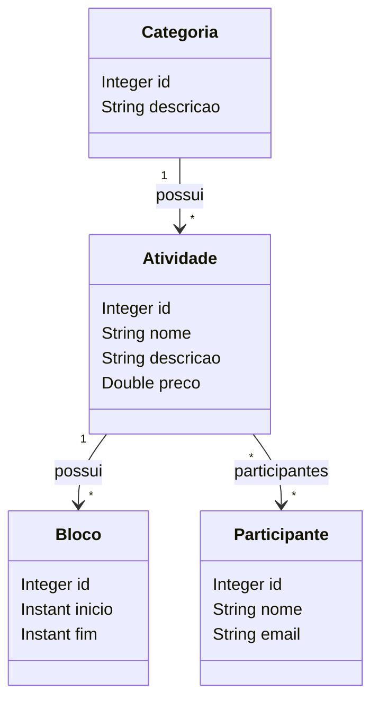

# Desafio: Modelo de Domínio e ORM

Este repositório contém a resolução do desafio **Modelo de Domínio e ORM**, desenvolvido no capítulo 2 do curso **Java Spring Professional**.

O projeto tem como objetivo praticar a criação de um modelo de domínio com **Spring Boot**, **JPA/Hibernate** e banco de dados **H2**, implementando entidades, relacionamentos e carga inicial de dados por meio de um script SQL.

## Sobre o desafio

O desafio propõe a criação de uma aplicação para representar o domínio de um sistema de eventos acadêmicos.

Nesse sistema, deseja-se gerenciar participantes, atividades, categorias e blocos de horário. As atividades podem representar cursos, oficinas, palestras ou outras ações realizadas durante um evento.

Cada atividade possui:

- Nome;
- Descrição;
- Preço;
- Categoria;
- Um ou mais blocos de horário;
- Um ou mais participantes inscritos.

Cada participante possui:

- Nome;
- Email;
- Lista de atividades das quais participa.

Além da modelagem das entidades, o projeto também exige a criação automática das tabelas no banco H2 e o seeding da base de dados com os registros definidos no enunciado.

## O que foi cobrado

O desafio solicitava que a solução fosse desenvolvida em **Java com Spring Boot**, utilizando **JPA/Hibernate** para o mapeamento objeto-relacional e **H2** como banco de dados em memória.

A aplicação deveria conter:

- Entidades Java representando o modelo conceitual proposto;
- Mapeamento das entidades com anotações JPA;
- Relacionamento muitos-para-um entre atividade e categoria;
- Relacionamento um-para-muitos entre atividade e blocos de horário;
- Relacionamento muitos-para-muitos entre atividade e participante;
- Geração automática das tabelas no banco H2;
- Inserção inicial dos dados por meio do arquivo `import.sql`;
- Projeto executável localmente pelo professor por meio do Spring Boot.

## Modelo de domínio

O domínio do projeto foi organizado em quatro entidades principais: `Participante`, `Atividade`, `Categoria` e `Bloco`.



## Estrutura do projeto

A solução foi organizada em entidades JPA, responsáveis por representar as tabelas e os relacionamentos do banco de dados.

### `Participante`

Classe responsável por representar os participantes do evento.

Ela contém os atributos:

- `id`: identificador do participante;
- `nome`: nome do participante;
- `email`: email do participante.

A entidade possui um relacionamento **muitos-para-muitos** com `Atividade`, pois um participante pode estar inscrito em várias atividades, e uma atividade pode conter vários participantes.

### `Atividade`

Classe responsável por representar as atividades do evento, como cursos, oficinas ou palestras.

Ela contém os atributos:

- `id`: identificador da atividade;
- `nome`: nome da atividade;
- `descricao`: descrição da atividade;
- `preco`: preço da atividade.

Essa entidade concentra os principais relacionamentos do domínio:

- Muitas atividades podem pertencer a uma mesma categoria;
- Uma atividade pode possuir vários blocos de horário;
- Uma atividade pode possuir vários participantes.

No relacionamento muitos-para-muitos com `Participante`, a entidade `Atividade` foi definida como o lado dono da associação, criando a tabela intermediária `tb_atividade_participante`.

### `Categoria`

Classe responsável por representar a categoria de uma atividade.

Ela contém os atributos:

- `id`: identificador da categoria;
- `descricao`: descrição da categoria.

A entidade possui um relacionamento **um-para-muitos** com `Atividade`, pois uma categoria pode estar associada a várias atividades.

### `Bloco`

Classe responsável por representar os blocos de horário de uma atividade.

Ela contém os atributos:

- `id`: identificador do bloco;
- `inicio`: data e horário de início;
- `fim`: data e horário de término.

A entidade possui um relacionamento **muitos-para-um** com `Atividade`, pois uma atividade pode ter vários blocos, mas cada bloco pertence a uma única atividade.

Os campos de data e hora foram modelados com `Instant`, utilizando a definição de coluna `TIMESTAMP WITHOUT TIME ZONE`.

## Relacionamentos implementados

### Atividade e Categoria

Relacionamento **muitos-para-um**.

```java
@ManyToOne
@JoinColumn(name = "categoria_id")
private Categoria categoria;
```

Esse relacionamento indica que várias atividades podem pertencer à mesma categoria.

### Atividade e Bloco

Relacionamento **um-para-muitos** do lado de `Atividade` e **muitos-para-um** do lado de `Bloco`.

```java
@OneToMany(mappedBy = "atividade")
private List<Bloco> blocos = new ArrayList<>();
```

```java
@ManyToOne
@JoinColumn(name = "atividade_id")
private Atividade atividade;
```

Esse relacionamento indica que uma atividade pode ser dividida em vários blocos de horário.

### Atividade e Participante

Relacionamento **muitos-para-muitos**.

```java
@ManyToMany
@JoinTable(
    name = "tb_atividade_participante",
    joinColumns = @JoinColumn(name = "atividade_id"),
    inverseJoinColumns = @JoinColumn(name = "participante_id")
)
private Set<Participante> participantes = new HashSet<>();
```

Esse relacionamento indica que uma atividade pode possuir vários participantes, e um participante pode estar inscrito em várias atividades.

## Seeding da base de dados

A carga inicial dos dados foi feita por meio do arquivo `import.sql`, localizado na pasta `src/main/resources`.

O script insere:

- 2 categorias;
- 4 participantes;
- 2 atividades;
- Associações entre atividades e participantes;
- 3 blocos de horário vinculados às atividades.

Ao executar a aplicação, o Hibernate cria as tabelas automaticamente e executa o script de importação, permitindo validar os dados no H2 Console.

## Tecnologias utilizadas

- Java
- Spring Boot
- Spring Data JPA
- Hibernate
- H2 Database
- Maven
- Programação orientada a objetos
- Mapeamento objeto-relacional

## Como executar o projeto

Clone o repositório:

```bash
git clone git@github.com:klesleySilvaOliveira/ds-jsp-desafio-2.git
```

Acesse a pasta do projeto:

```bash
cd ds-jsp-desafio-2
```

Execute a aplicação no Linux ou macOS:

```bash
./mvnw spring-boot:run
```

No Windows PowerShell:

```bash
.\mvnw spring-boot:run
```

## Acessando o banco H2

Após iniciar a aplicação, acesse o H2 Console no navegador:

```text
http://localhost:8080/h2-console
```

Utilize os dados de conexão configurados no projeto:

```text
JDBC URL: jdbc:h2:mem:testdb
User Name: sa
Password:
```

Depois de conectar, é possível consultar as tabelas criadas automaticamente, como:

- `tb_categoria`
- `tb_participante`
- `tb_atividade`
- `tb_bloco`
- `tb_atividade_participante`

## Exemplos de consultas no H2

Listar todas as atividades:

```sql
SELECT * FROM tb_atividade;
```

Listar todos os participantes:

```sql
SELECT * FROM tb_participante;
```

Listar os blocos de horário das atividades:

```sql
SELECT * FROM tb_bloco;
```

Listar as inscrições de participantes em atividades:

```sql
SELECT * FROM tb_atividade_participante;
```

Consultar atividades com suas categorias:

```sql
SELECT 
    a.id,
    a.nome,
    a.descricao,
    a.preco,
    c.descricao AS categoria
FROM tb_atividade a
INNER JOIN tb_categoria c ON c.id = a.categoria_id;
```

## Conceitos praticados

Este projeto reforça conceitos importantes para o desenvolvimento com Spring Boot e persistência de dados:

- Criação de entidades JPA;
- Uso de `@Entity` e `@Table`;
- Definição de chave primária com `@Id` e `@GeneratedValue`;
- Mapeamento de relacionamento muitos-para-um com `@ManyToOne`;
- Mapeamento de relacionamento um-para-muitos com `@OneToMany`;
- Mapeamento de relacionamento muitos-para-muitos com `@ManyToMany`;
- Criação de tabela de associação com `@JoinTable`;
- Uso de `@JoinColumn`;
- Uso de coleções `List` e `Set` em relacionamentos;
- Implementação de `equals` e `hashCode` nas entidades;
- Uso do banco H2 em ambiente de teste;
- Inserção inicial de dados com `import.sql`;
- Validação das tabelas e relacionamentos pelo H2 Console.

## Observação

Este projeto foi desenvolvido com finalidade educacional, como parte do processo de aprendizado de modelagem de domínio e ORM com Spring Boot.

O foco principal não está na criação de uma API REST completa, mas sim na correta representação do modelo conceitual em classes Java, no mapeamento das relações entre entidades e na geração da estrutura correspondente no banco de dados relacional.
